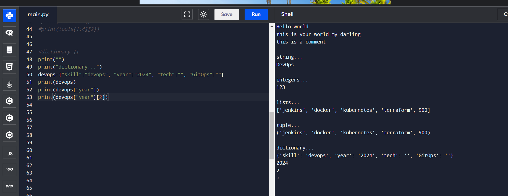

# VARIABLES
## JSON and YAML

A variable is a symbolic name or identifier associated with a value or data that can be changed. In programming, variables are used to store and manipulate data. The value stored in a variable can be updated or modified during the execution of a program.

Variables are temporary storage of data in the memory, in the RAM.

A variable should have a name and no space in between them; skill, equal to and the double quotes (`skill="DevOps"`)

In this example, "skill" is the variable and storage, and it is assigned the value "DevOps". 

In order to print it we can use __echo__. (`echo $skill`). And in bash you have to use dollar sign($). 

So we stored the data and we retrieved it using the echo command.

Dollar sign($) is important here, if we remove the dollar sign and just hit enter like this, it will just print the text "skill".

 

And you can also put it like this `echo "i am learning $skill"`

Skill is a variable of type string, String generally refers to text, Which we generally put in double quotes or single quote. But when trying to access the variables we put it in double quotes.

for double quotes: `echo "i am learning $skill"`

for single quote: `echo 'i am learning $skill'` it will remove the meaning of the dollar.

for integer: `NUM=123`

we are using echo command to print on the shell

for variables we use echo to retrieve our stored data but in python we use print and no dollar sign `print(skill)`

In python, this prints nothing. `print("")`

For list variables it will be in square bracket[]. so whenever you see it in square brackets and the elements are seperated by a comma, that is a list in python and also in JSON.

Difference beteen list and tuple is that list is in square bracket[], while tuple is in parenthesis().

To retrieve a particular element from the list or from tuple, just type the variable name and the index number `print(tools[1])`

Dictionary: Any dictionary has its name and meaning, so there is a key which is the name and meaning which is the value. And dictionary will be in curly braces{}.

To create a dictionary with the name `devops={}` and the data will be stored in the key value pairs. `devops={"skill":"DevOps", "year":""}`. skill is the key and its value is devops.

To have multiple key and values use comma and space to list them out

Double quotes in python means string while numbers are integer

__JSON__: JSON stands for JavaScript Object Notation, and it is a lightweight data interchange format. It is easy for humans to read and write and easy for machines to parse and generate. JSON data is represented as key-value pairs, similar to how objects are defined in many programming languages.

Let's write more complex values for tech and gitops

for tech , its value is an empty string so let's create a dictionary.

so tech is the key and its value is a dictionary, then cloud is the key and its value is AWS etc

let's make Gitops value a list

- skill is a key, it's value is a string.

- year value is an integer.

- tech value is a dictionary, and Gitops key, its value is a list.

This is JSON

__YAML__ (YAML Ain't Markup Language) is a human-readable data serialization format. It's often used for configuration files and data exchange between languages with different data structures.

for yaml we will remove all the brackets,curly braces,comma etc. You can also remove the double quotes it's not a problem

for yaml, the spacing is very important. That's the main syntax here.

most of the tools and configuration these days uses YAML to write configuration and to read data mostly JSON is used.

Devops is a dictionary that has 3 keys, one of its key value is a dictionary and inside it we have a key that its value is a list.

